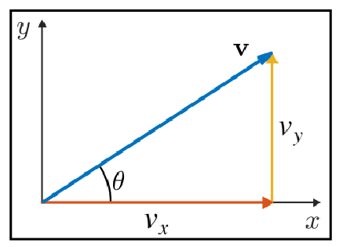
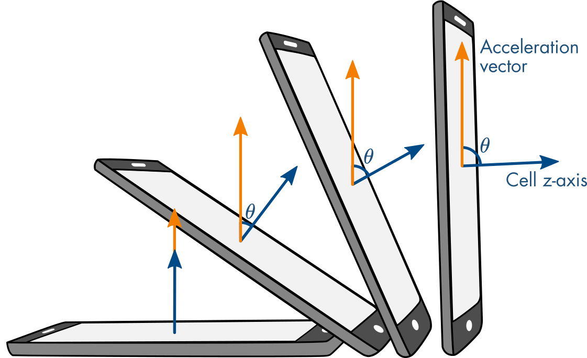
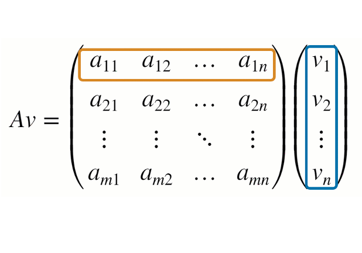
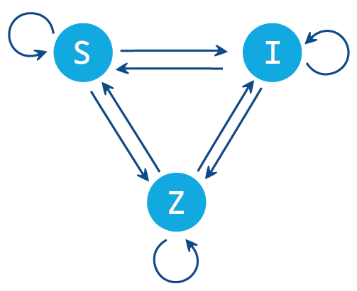

# Vector Arithmetic

 or 

**Curriculum Module**

_Created with R2020b. Compatible with R2020b and later releases._

# Information

This curriculum module contains interactive [MATLAB® live scripts](https://www.mathworks.com/products/matlab/live-editor.html) that teach the fundamental concepts of vectors, such as vector magnitude and addition.

## Background

You can use these live scripts as demonstrations in lectures, class activities, or interactive assignments outside class. [<samp>VectorBasics</samp>](https://matlab.mathworks.com/open/github/v1?repo=MathWorks-Teaching-Resources/Vector-Arithmetic&project=VectorArithmetic.prj&file=VectorBasics.mlx) is an interactive lesson that teaches the basics of individual vectors, such as vector components, vector magnitude, and vector orientation. [<samp>VectorArithmetic</samp>](https://matlab.mathworks.com/open/github/v1?repo=MathWorks-Teaching-Resources/Vector-Arithmetic&project=VectorArithmetic.prj&file=VectorArithmetic.mlx) is an interactive lesson that teaches vector arithmetic. Vector addition, scalar multiplication, dot product, and cross product are discussed. These methods are motivated by an application: calculating the orientation of a cell phone using the built-in accelerometer and magnetometer. Throughout the module, students apply the mathematical techniques to computing meaningful values, such as pitch and yaw.

The instructions inside the live scripts will guide you through the exercises and activities. Get started with each live script by running it one section at a time. To stop running the script or a section midway (for example, when an animation is in progress), use the  Stop button in the **RUN** section of the **Live Editor** tab in the MATLAB Toolstrip.

## Contact Us

Solutions are available upon instructor request. Contact the [MathWorks teaching resources team](mailto:onlineteaching@mathworks.com) if you would like to request solutions, provide feedback, or if you have a question.

## Prerequisites

This module assumes knowledge of high school algebra and trigonometry. It does not assume any MATLAB knowledge. All scripts are intended to be used in Hidden Code mode. 

## Getting Started
### Accessing the Module
### **On MATLAB Online:**

Use the   link to download the module. You will be prompted to log in or create a MathWorks account. The project will be loaded, and you will see an app with several navigation options to get you started.

### **On Desktop:**

Download or clone this repository. Open MATLAB, navigate to the folder containing these scripts and double-click on [VectorArithmetic.prj](https://matlab.mathworks.com/open/github/v1?repo=MathWorks-Teaching-Resources/Vector-Arithmetic&project=VectorArithmetic.prj). It will add the appropriate files to your MATLAB path and open an app that asks you where you would like to start. 

Ensure you have all the required products ([listed below](#H_E850B4FF)) installed. If you need to include a product, add it using the Add-On Explorer. To install an add-on, go to the **Home** tab and select   **Add-Ons** > **Get Add-Ons**. 

## Products

MATLAB® and Symbolic Math Toolbox™ are used throughout this module.

# Scripts
## [**VectorBasics.mlx**](https://matlab.mathworks.com/open/github/v1?repo=MathWorks-Teaching-Resources/Vector-Arithmetic&project=VectorArithmetic.prj&file=VectorBasics.mlx) 
|  | **In this script, students will...**  |
| :-- | :-- |
|  | <ul><li>  Relate the components of a vector to its visualization in 2- and 3-dimensions  <li>  Compute the magnitude of a vector in 2- and 3-dimensions  <li>  Compute the orientation of a vector in 2-dimensions  <li>  Discuss the meaning of the magnitude of an accelerometer reading  <li>  Relate the pitch of a cell phone to accelerometer readings </ul> |
|||

## [**VectorArithmetic.mlx**](https://matlab.mathworks.com/open/github/v1?repo=MathWorks-Teaching-Resources/Vector-Arithmetic&project=VectorArithmetic.prj&file=VectorArithmetic.mlx) 

|  | **In this script, students will...**  |
| :-- | :-- |
|  | <ul><li>  Add and subtract vectors  <li>  Compute scalar, dot, and cross products of vectors  <li>  Relate arithmetic vector operations to visual representations  <li> Identify the physical meaning of the results of arithmetic vector operations  <li>  Apply vector arithmetic to compute the yaw of a cell phone  |
|      |       |

# License

The license for this module is available in the [LICENSE.md](https://github.com/MathWorks-Teaching-Resources/Vector-Arithmetic/blob/release/LICENSE.md).

# Related Courseware Modules
|      |      |      |
| :-- | :-- | :-- |
| **Courseware Module** | **Sample Content** | **Available on:**  |
| [**Matrix Methods of Linear Algebra**](https://www.mathworks.com/matlabcentral/fileexchange/94730-matrix-methods-of-linear-algebra) |  |     [GitHub](https://github.com/MathWorks-Teaching-Resources/Matrix-Methods-of-Linear-Algebra)  |
| [**Applied Linear Algebra**](https://www.mathworks.com/matlabcentral/fileexchange/136364-applied-linear-algebra) |  |      [GitHub](https://github.com/MathWorks-Teaching-Resources/Applied-Linear-Algebra)  |
|      |      |       |

Or feel free to explore our other [modular courseware content](https://www.mathworks.com/matlabcentral/fileexchange/?q=tag%3A%22courseware+module%22&sort=downloads_desc_30d).

# Educator Resources
-  [Educator Page](https://www.mathworks.com/academia/educators.html) 

# Contribute 

Looking for more? Find an issue? Have a suggestion? Please contact the [MathWorks teaching resources team](mailto:%20onlineteaching@mathworks.com). If you want to contribute directly to this project, you can find information about how to do so in the [CONTRIBUTING.md](https://github.com/MathWorks-Teaching-Resources/Vector-Arithmetic/blob/release/CONTRIBUTING.md) page on GitHub.

© Copyright 2023 The MathWorks™, Inc

